# EMS BFS - Dokumentasi Topologi Fitur Menyeluruh

Dokumen ini memetakan seluruh topologi fitur dan struktur yang ada pada proyek EMS BFS (Environmental Monitoring System). Topologi ini mencakup arsitektur halaman (frontend), layanan API (backend), hierarki komponen, serta aliran data utamanya.

---

## 1. Topologi Halaman (Frontend Pages)

Aplikasi dibangun menggunakan Next.js 14+ dengan paradigma **App Router** (`app/`). Berikut adalah pemetaan rute halaman dan fungsionalitasnya:

- **`/` (Main Dashboard)** `app/page.tsx`
  - **Fungsi**: Halaman utama untuk pemantauan parameter lingkungan secara *real-time*.
  - **Fitur Spesifik**: 
    - Menampilkan kartu sensor (Suhu, Kelembaban, Tekanan Diferensial).
    - Memiliki fitur "Edit (⚙️)" langsung pada kartu untuk mengonfigurasi ID Sensor (menembak API `/api/get-room-details` dan `/api/edit-room`).
    - *Auto-refresh/Polling* data berkala.

- **`/data-management`** `app/data-management/page.tsx`
  - **Fungsi**: Manajemen entitas sistem (Master Data).
  - **Fitur Spesifik**:
    - **Manajemen Ruangan**: Tambah, edit, dan hapus ruangan beserta pengikatan multi-parameter (DP, RH, TEMP) menggunakan penanganan konflik *Unique Constraint*.
    - **Manajemen Eksklusi/Fumigasi**: Pengaturan penjadwalan pengecualian data sensor untuk kalibrasi atau fumigasi.

- **`/reports`** `app/reports/page.tsx`
  - **Fungsi**: Pusat pelaporan dan analitik historis.
  - **Fitur Spesifik**:
    - Pembangkitan laporan (*Report Generator*) dengan pemfilteran berbasis parameter dan rentang waktu.
    - Ekspor laporan ke format PDF (menggunakan `jspdf`, `jspdf-autotable`, dan `html2canvas`).
    - Agregasi data tingkat menit untuk mencegah duplikasi *timestamp*.

- **`/emails`** `app/emails/page.tsx`
  - **Fungsi**: Pengaturan konfigurasi notifikasi peringatan (*Alerting*).
  - **Fitur Spesifik**:
    - **Pengaturan Durasi Alarm**: Konfigurasi toleransi waktu/interval *anti-spam* sebelum email dikirim.
    - **Manajemen Penerima**: CRUD daftar alamat email (Milis) untuk notifikasi *alert*.

- **`/audit-log`** `app/audit-log/page.tsx`
  - **Fungsi**: Pusat jejak audit keamanan dan sistem (*Audit Trail*).
  - **Fitur Spesifik**: Menampilkan log seluruh aktivitas navigasi (PageView) maupun aksi sistem (CRUD, Cetak Laporan).

---

## 2. Topologi API & Backend Services (Endpoint Rute)

Seluruh logika backend dan operasi ke *database* PostgreSQL berjalan pada infrastruktur *serverless* di dalam folder `app/api/`:

### A. Layanan Sensor & Real-Time
- **`/api/latest-reading`**: Mengambil nilai data sensor paling mutakhir (digunakan oleh *Dashboard* untuk *polling*).
- **`/api/sensor-readings`**: Menarik data historis pembacaan sensor.
- **`/api/sensor-stats`**: Menarik data statistik atau agregasi performa sensor.
- **`/api/update-comment`**: (Opsional) Memperbarui anotasi/komentar pada pembacaan sensor tertentu.

### B. Layanan Manajemen Ruangan & Parameter
- **`/api/rooms`**: Menarik seluruh daftar/hierarki ruangan.
- **`/api/add-room`**: Mendaftarkan ruangan dan parameter baru.
- **`/api/get-room-details`**: Menarik data lengkap spesifik dari sebuah ruangan (sering dipanggil dari *modal edit* Dashboard).
- **`/api/edit-room`**: Memperbarui atribut ruangan. Memiliki mekanisme *"Disconnect & Reassign"* untuk mengamankan data historis jika terjadi pergantian `external_log_id`.

### C. Layanan Pelaporan & Ekspor Data
- **`/api/report-readings`**: Menarik kumpulan data sensor berbasis kueri tanggal dan unit yang spesifik untuk di-*render* ke tabel/PDF.

### D. Layanan Eksklusi & Manajemen Operasional
- **`/api/exclusions`** & **`/api/get-exclusions`**: Menarik daftar eksklusi data (Fumigasi/Kalibrasi) yang aktif maupun historis.
- **`/api/add-exclusion`**: Membuat jadwal eksklusi baru.

### E. Layanan Notifikasi Email & Alarm
- **`/api/alarm-config`**: Menangani GET & POST (Update/Insert) untuk durasi/interval *delay* alarm.
- **`/api/emails`**: Menangani CRUD untuk alamat-alamat email *subscriber* peringatan alarm.
- **`/api/send-alert`**: Eksekutor (*trigger*) pengiriman email via `nodemailer`.

### F. Layanan Sistem & Keamanan
- **`/api/audit`**: Menarik daftar log jejak audit untuk di-*render* di halaman Audit.
- **`/api/optimize-db`**: Skrip/layanan untuk optimalisasi atau perbaikan struktur database dan tabel.

---

## 3. Topologi Komponen UI (Frontend Components)

Sebagian besar elemen antarmuka dapat digunakan ulang (reusable) dan terstruktur dalam direktori `components/`:

- **`dashboard/`**:
  - Kartu Metrik (Room Cards) yang mampu mendeteksi tipe multi-parameter.
  - Grafik mini (Mini charts) untuk pembacaan cepat di halaman depan.
- **`data/`**:
  - `DataTable.tsx`: Tabel data universal dengan kapabilitas sortir dan filter.
  - Komponen Form Modals (untuk tambah ruangan, eksklusi, dan edit parameter).
- **`reports/`**:
  - `ReportGenerator.tsx`: Komponen untuk merangkai input tanggal, filter, dan tombol ekspor.
  - `MetricChart.tsx` (menggunakan `recharts`): Grafik analitik khusus laporan.
- **`layout/`**:
  - Navbar, Sidebar Menu, Header.
- **`ui/`**: 
  - Kumpulan UI statis seperti *Buttons*, *Inputs*, *Popovers*, dll (Berdasarkan *Radix UI* & *Tailwind*).
- **Komponen Spesial (Global)**:
  - `AuditRouteListener.tsx`: Komponen yang dipasang pada root untuk melacak navigasi *user* dan mengirimkannya ke Audit Trail.
  - `TutorialComponent.tsx`: Menangani Onboarding Tour (menggunakan `react-joyride`) bagi pengguna baru. Memiliki *state management* `idle | running | paused`. Langkah pencarian elemen (`steps`) disinkronisasikan menggunakan *selector* berbasis HTML ID unik di semua halaman (Dashboard, Data Management, Reports, Emails, dan Audit Log) untuk keandalan maksimal tanpa terpengaruh oleh restrukturisasi class CSS.

---

## 4. Alur Interaksi dan State Management Utama

- **Data Polling & Sinkronisasi**: Aplikasi menggunakan *React Hooks* (`useEffect`, `setInterval`) di *frontend* untuk berulang kali menembak endpoint `/api/latest-reading`. Tidak ada *WebSocket* yang dipakai, sehingga bergantung murni pada *REST API polling*.
- **Onboarding Tutorial State**: Diatur oleh `TutorialContext` yang dikombinasikan dengan interaksi *Toggle* di panel kontrol/sidebar, memungkinkan tutorial bisa dihentikan sementara (pause) atau dilanjutkan antar-halaman.
- **Global Memory vs Database**: Beberapa preferensi sistem, seperti Durasi Alarm, selain disimpan ke dalam PostgreSQL, nilainya juga disinkronisasikan ke dalam *in-memory store* (`@/lib/store` atau context) agar aplikasi backend dapat berjalan efisien tanpa melakukan kueri verifikasi secara masif setiap detik.
- **Audit Logging Workflow**: Setiap API yang melakukan `POST/PUT/DELETE` wajib memanggil `createAuditLog()` dari `lib/audit-logger.ts` setelah transaksi database dikomit (*COMMIT*). 

## 5. Basis Database Utama
Secara keseluruhan, EMS berinteraksi dengan tabel-tabel utama di dalam PostgreSQL menggunakan pustaka `pg`:
- `BFS_EMS_Room` (Data Master Ruangan)
- `BFS_EMS_Data` (Data historis sensor)
- `BFS_EMS_ALARM_Duration` (Pengaturan waktu alarm)
- `ems_audit_logs` (Pusat Log Jejak Audit)
- (Tabel Manajemen Email dan Eksklusi Data)

---

## 6. Alur Kerja Terperinci (Flow Sequences A -> B -> C)

Berikut adalah urutan alur komunikasi dari Frontend (UI), ke Backend (API), hingga ke Database untuk fungsi-fungsi utama sistem:

### Alur 1: Pemantauan Data Dashboard (Polling)
Alur ini berjalan setiap beberapa detik untuk memperbarui angka di layar utama.

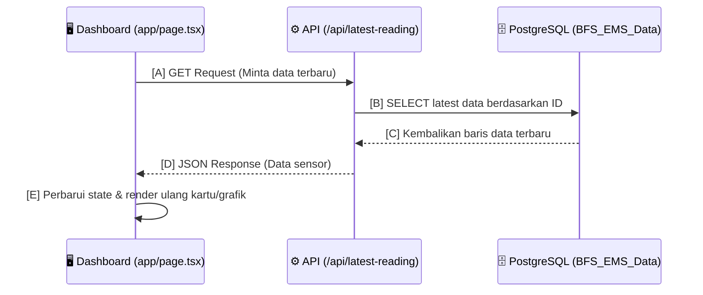
**Urutan:**
1. **[A]** Komponen `useEffect` di frontend memanggil `/api/latest-reading`.
2. **[B]** Backend menjalankan kueri SQL ke tabel `BFS_EMS_Data` untuk mengambil rekaman terakhir tiap sensor.
3. **[C & D]** Database mengembalikan hasil, lalu API meneruskannya ke frontend dalam bentuk JSON.
4. **[E]** Frontend memperbarui antarmuka pengguna tanpa *reload* halaman.

### Alur 2: Pengeditan ID Sensor dari Dashboard
Alur ketika pengguna mengklik ikon *gear* (⚙️) di kartu ruangan untuk mengganti ID alat (Logika Disconnect & Reassign).

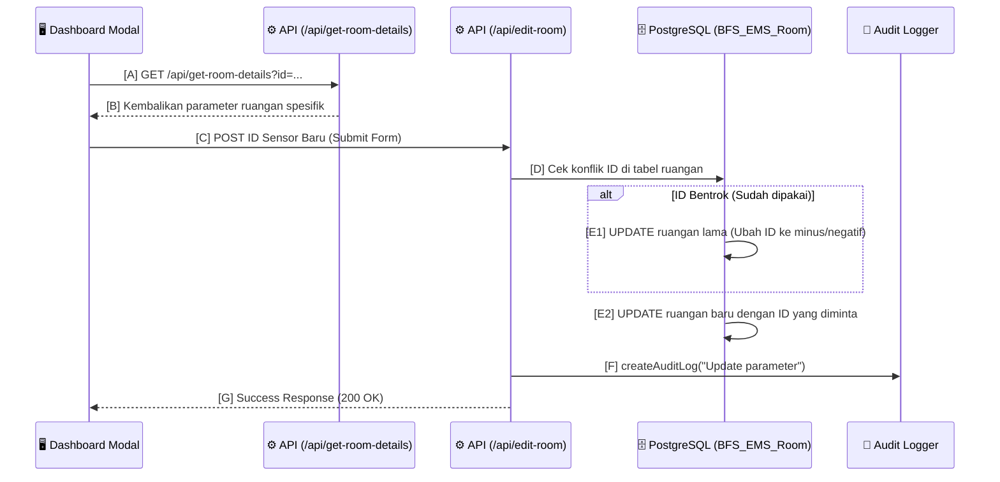
**Urutan:**
1. **[A & B]** Frontend menarik detail ruangan saat modal terbuka.
2. **[C]** User memasukkan ID baru dan menekan tombol simpan.
3. **[D & E]** API `edit-room` memeriksa ketersediaan ID. Jika bentrok, ruangan lama diputus ID-nya (*E1*), lalu ruangan baru diberikan ID tersebut (*E2*).
4. **[F & G]** Aktivitas dicatat di *Audit Trail*, dan konfirmasi dikembalikan ke UI.

### Alur 3: Pembangkitan Laporan & Cetak PDF
Alur penarikan data historis untuk keperluan laporan.

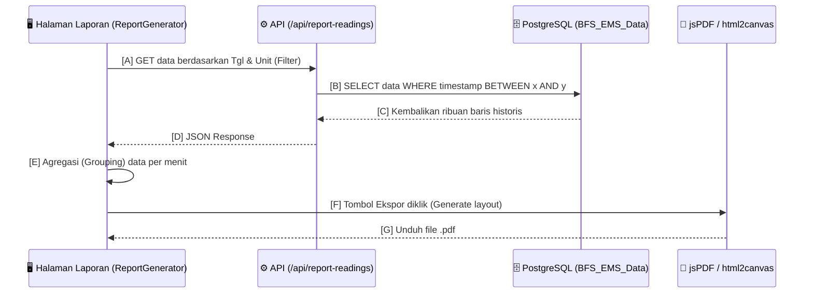
**Urutan:**
1. **[A]** Pengguna memilih rentang tanggal dan nama ruangan, lalu klik "Tampilkan".
2. **[B, C, D]** API menarik data mentah dari database sesuai filter dan mengirimkannya kembali ke antarmuka.
3. **[E]** Frontend melakukan proses agregasi data (menyatukan Temp, RH, DP ke dalam satu baris per menit).
4. **[F & G]** Library JS mengubah tabel DOM menjadi *Canvas* dan mengekstraknya sebagai dokumen PDF yang bisa diunduh.

### Alur 4: Konfigurasi Durasi Alarm (Email Alert)
Alur ini menunjukkan bagaimana pengaturan sistem (seperti toleransi *delay* alarm) disimpan dan disinkronisasikan.

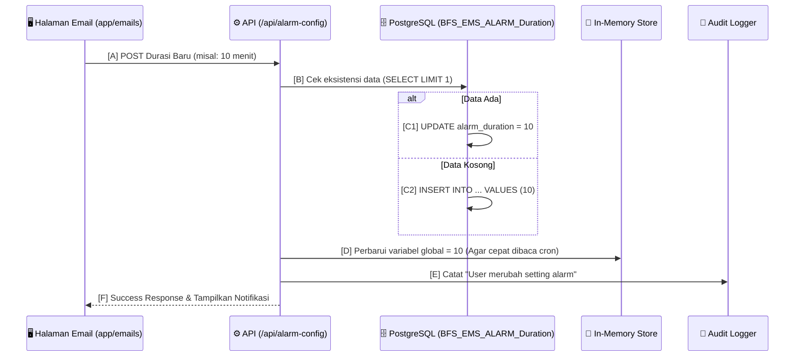
**Urutan:**
1. **[A]** User mengetik angka durasi dan klik "Simpan Durasi".
2. **[B & C]** API melakukan pengecekan; menimpa (*UPDATE*) jika baris konfigurasi sudah ada, atau membuat baru (*INSERT*) jika masih kosong.
3. **[D]** Konfigurasi tidak hanya disimpan di DB, tetapi diperbarui juga di *Memory Cache* (`globalSettings`).
4. **[E & F]** Jejak disimpan di *Audit Log*, dan pesan sukses dimunculkan di layar pengguna.

### Alur 5: Manajemen Data Ruangan Baru (Add Room)
Alur pendaftaran master data ruangan beserta parameter sensornya (Temp, RH, DP).

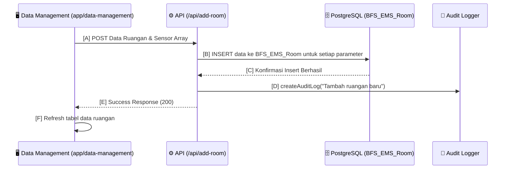
**Urutan:**
1. **[A]** Pengguna mengisi form "Tambah Ruangan" dan mencentang parameter apa saja yang digunakan.
2. **[B & C]** API `/api/add-room` menyimpan setiap parameter tersebut ke dalam database (1 ruangan dengan banyak sensor akan memiliki banyak baris (satu per parameter)).
3. **[D, E, & F]** Aksi dicatat dalam *Audit Trail*, dan antarmuka akan menarik kembali data terbaru untuk dirender di tabel.

### Alur 6: Penjadwalan Eksklusi Data (Fumigasi/Kalibrasi)
Alur untuk mengecualikan pembacaan data sensor dari alarm dan laporan saat masa perawatan.

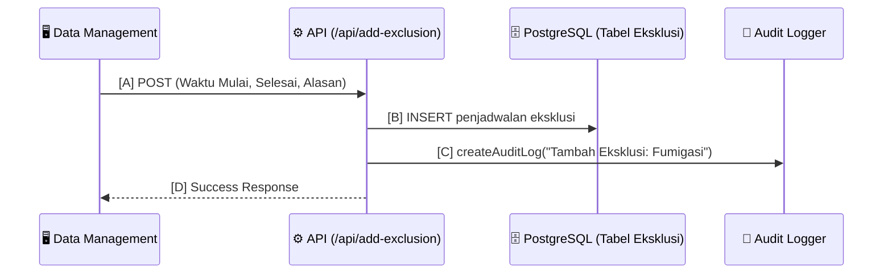
**Urutan:**
1. **[A]** Admin mengisi form penjadwalan eksklusi dengan batas waktu.
2. **[B]** Data dimasukkan ke tabel eksklusi. Sistem *Alert* akan selalu mengecek tabel ini sebelum mengirim email.
3. **[C & D]** Tindakan dicatat ke log audit dan tampilan diperbarui.

### Alur 7: Manajemen Email Penerima *Alert*
Alur pendaftaran alamat email untuk langganan peringatan sensor anomali.

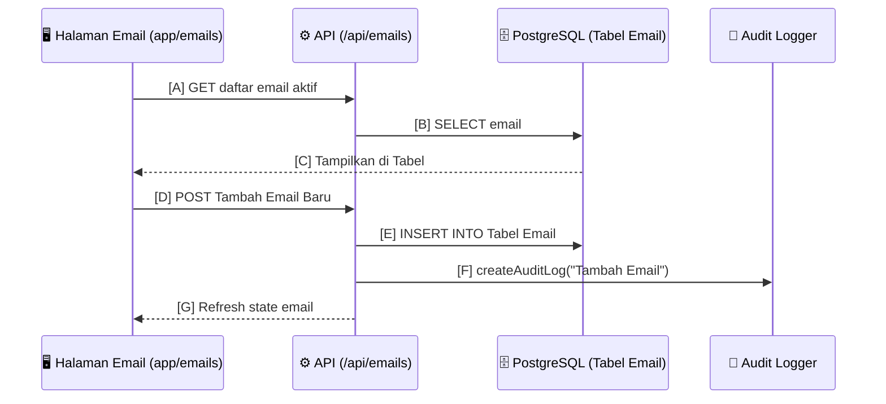
**Urutan:**
1. **[A, B, C]** Saat halaman dimuat, sistem menarik daftar seluruh email aktif.
2. **[D & E]** Saat menambahkan alamat email baru, API mengirim data (INSERT) ke *database*.
3. **[F & G]** Aktivitas direkam dan daftar tabel diperbarui (*Refresh*).

### Alur 8: Perekaman & Pengecekan Jejak Audit (Audit Trail)
Setiap aktivitas pengguna dalam memanipulasi data direkam di balik layar.

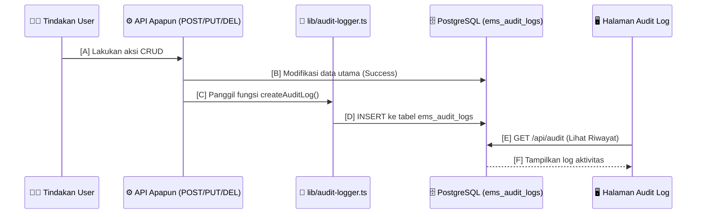
**Urutan:**
1. **[A & B]** *User* melakukan tindakan yang mengubah konfigurasi atau *database*.
2. **[C & D]** Setelah sukses, *endpoint* memanggil *logger* untuk menyelipkan rekaman aktivitas ke dalam `ems_audit_logs`.
3. **[E & F]** Admin dapat meninjau semua rekam jejak tersebut di halaman *Audit Log*.

### Alur 9: Background Peringatan Anomali (Send Alert)
Alur pengiriman notifikasi email saat terdeteksi ambang batas dilewati (*Out of Spec*).

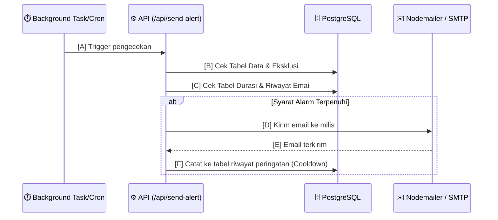
**Urutan:**
1. **[A, B, C]** Servis *background* memicu `/api/send-alert`, sistem mengecek data sensor anomali, mencocokkan dengan jadwal eksklusi, serta durasi toleransi *anti-spam*.
2. **[D]** Jika semua syarat terpenuhi (anomali terjadi > batas durasi delay & tidak ada eksklusi), API menembak *SMTP Server* menggunakan *Nodemailer*.
3. **[E & F]** Mengupdate status bahwa email telah terkirim agar tidak terjadi pengiriman ganda pada interval berikutnya.

### Alur 10: Onboarding Interaktif (Tutorial System)
Alur panduan penggunaan sistem untuk pemula menggunakan `react-joyride`.

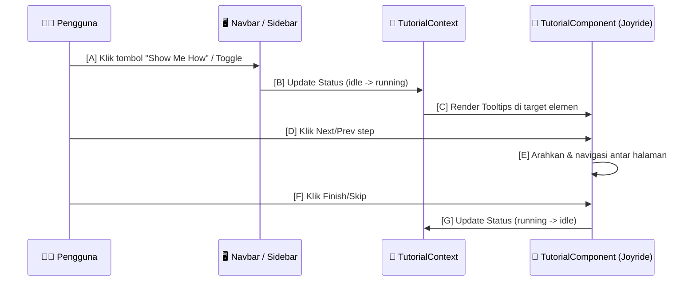
**Urutan:**
1. **[A & B]** *User* mengklik tombol *Toggle* panduan, ini mengubah `Context State` menjadi berjalan (*running*).
2. **[C, D, E]** Komponen Joyride memunculkan *tooltip* penjelasan fitur dan memandu navigasi secara otomatis sesuai langkah yang ditetapkan.
3. **[F & G]** Saat panduan berakhir, *state* dikembalikan ke *idle* sehingga tutorial hilang dan bisa dijalankan kembali kapan saja.

### Alur 11: Pemfilteran Data dan Normalisasi Parameter (Filtering & Grouping)
Alur pemrosesan data (terutama di komponen Laporan dan Tabel Data) untuk memfilter, menormalisasi penamaan ruangan, dan menggabungkan beberapa parameter (Suhu, RH, DP) ke dalam satu baris waktu yang sama, mencegah duplikasi akibat perbedaan mikro-detik (*sub-millisecond*).

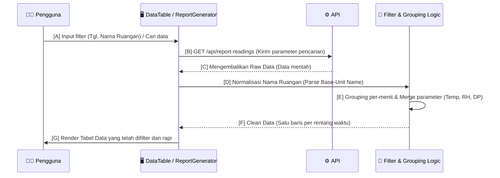
**Urutan:**
1. **[A, B, C]** Pengguna menerapkan kriteria pencarian/filter di antarmuka (UI). Antarmuka meminta data mentah ke API.
2. **[D]** Logika *frontend* (atau utilitas *parsing*) menormalisasi nama unit ruangan (membuang sufiks ekstra untuk mengelompokkan sensor DP yang bercabang).
3. **[E & F]** Data diproses dan diagregasi pada tingkatan menit (*minute-level grouping*) untuk menyatukan baris-baris sensor yang berbeda ke dalam satu baris tabel.
4. **[G]** Tabel menampilkan data final yang sudah bebas duplikasi kepada pengguna.