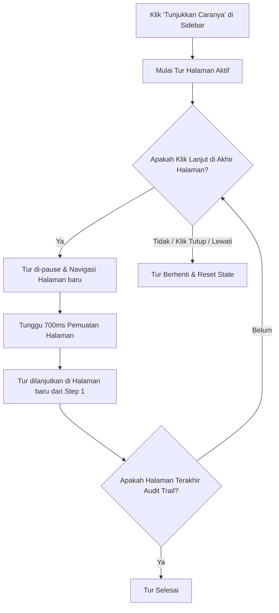

# Dokumentasi Sistem Onboarding Tutorial (EMS BFS)

Dokumen ini menjelaskan implementasi fitur **Onboarding Tutorial (Panduan Interaktif)** yang baru saja ditambahkan ke sistem AHU Monitoring EMS BFS. Fitur ini dirancang untuk memandu pengguna baru dalam memahami fungsionalitas utama dari setiap halaman secara interaktif menggunakan bahasa Indonesia.

---

## 1. Arsitektur & Teknologi Utama
Fitur ini dibangun di atas tumpukan teknologi berikut:
- **`react-joyride` (v3.1.0)**: Library React untuk membuat panduan interaktif step-by-step (*guided tours*).
- **React Context API (`contexts/TutorialContext.tsx`)**: Mengatur state global untuk memulai, menjeda, melanjutkan, dan menghentikan tutorial.
- **Next.js App Router Navigation hooks**: `usePathname` dan `useRouter` untuk mendeteksi lokasi rute dan melakukan navigasi antar halaman secara otomatis.

---

## 2. Struktur File & Pemetaan ID Elemen (Target Selector)
Untuk memastikan tutorial berjalan stabil tanpa bergantung pada class CSS bawaan Tailwind yang rentan berubah, seluruh elemen interaktif utama telah dipetakan menggunakan **HTML ID khusus**.

### A. Summary Modifikasi Penargetan Elemen (Target ID)
Berikut adalah daftar halaman beserta ID elemen yang didaftarkan ke dalam tutorial:

| Halaman | ID Target Selector | Deskripsi Elemen |
|---|---|---|
| **`/` (Dashboard)** | `#dashboard-room-filter` | Dropdown filter pengelompokan ruangan |
| | `#dashboard-kpi-summary` | Ringkasan metrik status operasional (KPI) |
| | `#dashboard-realtime-grid` | Grid monitoring suhu, kelembaban, dan tekanan real-time |
| **`/data-management`** | `#room-form` | Formulir data unit sensor ruangan |
| | `#temp`, `#rh`, `#dp1`, dst. | Input field parameter khusus sensor ruangan |
| | `#room-status` | Input status (aktif/non-aktif) sensor ruangan |
| | `#exclusion-form` | Formulir filter pengecualian data mentah |
| | `#exclusion-status` | Input status (aktif/non-aktif) filter pengecualian |
| | `#table-data` | Area tabel data telemetry sensor hasil fetching |
| | `#exclusion-list` | Panel list pengecualian/fumigasi aktif (Active Exclusions) |
| **`/reports` (Laporan)** | `#report-room-filter` | Dropdown pemilihan ruangan |
| | `#report-start-date` | Pilihan waktu awal laporan |
| | `#report-end-date` | Pilihan waktu akhir laporan |
| | `#report-interval-filter` | Pilihan interval penarikan data (misal: 1 menit, 1 jam) |
| | `#report-type-filter` | Dropdown jenis laporan status |
| | `#report-exclude-param` | Pilihan checkbox parameter yang ingin dikecualikan |
| | `#report-pull-data-btn` | Tombol manual untuk memicu fetching data |
| | `#report-summary-cards` | Ringkasan kartu data terfilter |
| | `#report-chart-preview` | Area pratinjau grafik/chart visual sensor |
| | `#report-pdf-export` | Tombol download laporan berformat PDF |
| **`/emails` (Alerts)** | `#email-alarm-config` | Panel konfigurasi interval alarm anti-spam |
| | `#email-add-form` | Formulir tambah email penerima alert baru |
| | `#email-list-table` | Tabel daftar penerima notifikasi email |
| **`/audit-log` (Audit)** | `#audit-filter-panel` | Panel filter riwayat jejak audit (Audit Trail) |
| | `#audit-log-table` | Tabel log histori audit keamanan |

---

## 3. Detail Modifikasi Kode Program

### A. Context Tutorial (`contexts/TutorialContext.tsx`)
Mengelola state global tutorial menggunakan satu tipe data status agar terhindar dari *race conditions* akibat pembaruan *state* asinkronus (batching) di React:
- **`status` ('idle' | 'running' | 'paused')**:
  - `'idle'`: Tur mati (tidak aktif).
  - `'running'`: Tur sedang aktif berjalan di halaman yang bersangkutan.
  - `'paused'`: Tur dijeda sementara selama navigasi rute halaman berlangsung.
- **Fungsi Utama**:
  - `startTutorial()`: Mengubah status ke `'running'` untuk memulai tur.
  - `pauseTutorial()`: Mengubah status ke `'paused'` untuk menonaktifkan rendering Joyride sementara waktu saat proses navigasi.
  - `resumeTutorial()`: Mengubah status kembali ke `'running'` setelah halaman baru termuat.
  - `stopTutorial()`: Mengubah status kembali ke `'idle'` untuk mengakhiri sesi tutorial secara tuntas.

### B. Komponen Tutorial (`components/TutorialComponent.tsx`)
Komponen utama yang me-render Joyride secara kondisional.
- **Dynamic Steps**: Menggunakan `useMemo` dengan dependensi `pathname` untuk memetakan target elemen CSS (`h1`, `#exclusion-form`, `#exclusion-list`, dll.) dan konten penjelasan bahasa Indonesia untuk setiap halaman.
- **State Reset (`key={pathname}`)**: Menggunakan properti `key` dengan nilai `pathname` pada komponen Joyride. Hal ini memaksa React untuk menghancurkan (*unmount*) instansi Joyride lama dan membuat instansi yang baru dari index `0` setiap kali pengguna berpindah halaman, mencegah retensi index langkah (*state retention bug*).
- **Seamless Transition Logic**:
  - Pada langkah terakhir di suatu halaman, tombol aksi berubah nama menjadi link halaman berikutnya (contoh: *"Lanjut ke Laporan"*).
  - Ketika diklik, callback mendeteksi status `finished`. Jika halaman saat ini memiliki halaman berikutnya, ia memanggil `pauseTutorial()` (mengubah status ke `'paused'`), lalu melakukan `router.push('/target-halaman')`.
  - Sebuah `useEffect` mendengarkan perubahan `pathname`. Jika status tur adalah `'paused'`, ia memasang timeout selama `700ms` untuk memberikan waktu halaman me-render elemen HTML baru, lalu memicu `resumeTutorial()` (mengubah status ke `'running'`) untuk memulai tur di halaman baru secara bersih dari langkah pertama.
  - Khusus pada halaman terakhir (`/audit-log`), langkah tur penutup akan menyorot elemen `#tutorial-toggler` (Switch Tutorial di Sidebar) untuk memberi panduan visual kepada pengguna bahwa sesi tur telah berakhir dan switch dapat dikembalikan ke mode mati.

### C. Sidebar Component (`components/layout/Sidebar.tsx`)
- Mengimpor hook `useTutorial` dan ikon `HelpCircle` dari `lucide-react`.
- Mengubah tombol **"Tunjukkan Caranya"** (atau *"Show Me How"*) menjadi **Toggle Switch** interaktif di bagian bawah sidebar:
  - Tombol akan menyala (*ON*) dengan warna biru jika tutorial sedang aktif (`running` atau `paused`).
  - Mengeklik switch saat *ON* akan memicu `stopTutorial()` untuk mematikan tur secara paksa.
  - Jika tur selesai secara alami (mengklik "Selesai", "Tutup", atau "Lewati"), status tur diubah ke `'idle'`, dan switch akan bergeser mati (*OFF*) secara otomatis.
- Menambahkan properti `id="tutorial-toggler"` pada elemen button switch di sidebar agar dapat ditargetkan oleh langkah penutup tutorial.
- Menambahkan properti `id` unik pada setiap link menu navigasi (`#DashboardMenu`, `#DataManagementMenu`, `#ReportsMenu`, `#EmailAlertsMenu`, `#AuditLogMenu`) agar dapat ditargetkan secara presisi oleh penyorot (overlay) Joyride.

### D. Provider & Layout Wrapper
- **`app/providers.tsx`**: Membungkus komponen anak (`children`) di dalam `LanguageProvider` dengan `TutorialProvider` baru agar statusnya dapat diakses dari mana saja.
- **`app/layout.tsx`**: Menyisipkan `<TutorialComponent />` di bagian bawah pohon DOM agar ia dapat menampilkan pop-up penunjuk (*popover*) secara global di semua halaman.

---

## 4. Alur Perilaku Pengguna (User Flow)

---

## 5. Cara Pengujian
1. Jalankan aplikasi menggunakan server pengembangan (`npm run dev`).
2. Masuk ke halaman **Dasbor**.
3. Klik tombol **"Tunjukkan Caranya"** pada sidebar sebelah kiri.
4. Ikuti instruksi pop-up penunjuk dengan mengeklik tombol **"Lanjut"**.
5. Pada akhir halaman Dasbor, klik tombol **"Lanjut ke Manajemen Data"**. Aplikasi akan berpindah halaman secara otomatis dan membuka panduan Manajemen Data langsung dari langkah pertama.
6. Coba klik tombol **"Lewati"** di tengah jalan untuk memastikan tutorial dapat ditutup sewaktu-waktu dengan sukses.